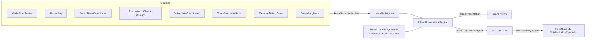
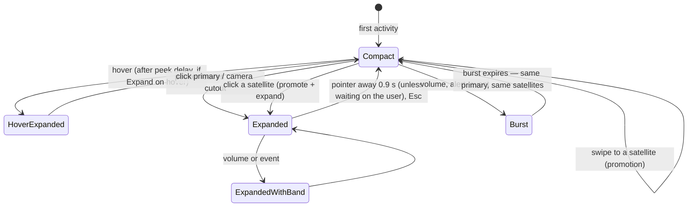

# Activity engine

NotchShot's notch can present several pieces of ongoing work at once: one
**primary** activity attached to the notch, up to two **satellites** beside it,
and a short **burst** (a volume change, a finished transfer) laid over the top
without destroying what is underneath. This document describes how that works
and where the rules are pinned.

The model borrows the interaction principles of Dynamic Island / Live
Activities and adapts them to the Mac: a hardware cutout that content must
avoid, pointer hover and click, trackpad swipes, and external displays with no
notch at all.

## Layers



| Layer | Type | File |
| --- | --- | --- |
| Activity model | `IslandActivity`, `IslandActivityID`, priority, lifecycle, progress | `Core/Island/IslandActivity.swift` |
| Adapters | existing models → activities | `Core/Island/IslandActivityAdapters.swift` |
| Engine | primary, satellites, selection, expansion, expiry | `Core/Island/IslandPresentation.swift` |
| Bursts | `IslandTransientEvent`, `IslandTransientQueue`, `IslandOverlay` | `Core/Island/IslandTransientEvent.swift` |
| Integration | collecting sources, user intent, services | `App/AppCoordinator+Island.swift` |
| Geometry | compact/expanded sizes, satellites, hit regions | `Window/NotchMetrics.swift` (`islandLayout`) |
| Views | container, shared elements, compact, expanded | `UI/Island/` |
| Gestures | swipe math and AppKit arbitration | `Input/IslandSwipeTracker.swift`, `Input/IslandGestureCoordinator.swift` |
| External API | socket, registry, CLI | `External/`, `NotchShotAIReporterSupport/LiveActivityProtocol.swift`, `NotchShotCLI/` |
| Focus | public `INFocusStatusCenter` only | `System/FocusStatusMonitor.swift` |

## Takeovers vs. activities

`ActivityArbiter` is still the single source of truth for what the notch
resolves to. It now distinguishes two families:

- **Takeovers** are modal states the user is driving: error, capture
  selection, countdown, dictation, processing, file drop, capture shelf, the
  capture menu, and mirrored notification banners. They replace the island
  while they last, exactly as before.
- **Activities** are long-lived work. With *Show multiple activities* on, they
  resolve to `NotchActivity.island(IslandLayoutDescriptor)`.

The resolved order is:

```
error → selecting → countdown → dictation → recording* → processing → file drop →
result → expanded → notification banner → island → system level → context → media → idle
```

`*` A recording the island presents resolves to `.island` **at the recording
rung**, so processing, a result, or the capture menu still cannot hide it.

When the island is enabled, `islandOwnsAmbientActivities` silences the legacy
media and persistent-context rungs, so hiding (say) timers from the island by
preference does not resurrect the old single-activity timer card. Turning the
island off restores the previous notch exactly; `ActivityPriorityTests` still
pins that path unchanged.

## Activities

Every activity has a **stable identity**: its kind plus a source-owned key
(`media:now-playing`, `timer:<uuid>`, `external:<reporter id>`). Titles,
percentages, transcripts and remaining time are never part of identity —
SwiftUI animates between identities, so a changing identity is exactly what
makes a view flicker.

| Field | Meaning |
| --- | --- |
| `priority` | `passive < normal < elevated < critical`. Decides who *may* lead. |
| `relevance` | 0…1. Breaks ties only when choosing a *new* primary. |
| `lifecycle` | `active`, `paused`, `waiting` (needs the user), `succeeded`, `failed`. |
| `progress` | `none`, `indeterminate`, or `determinate(fraction)`. Never estimated. |
| `measurement` | Real bytes/items, measured rate, ETA — only when a source measured them. |
| `interruptionPolicy` | `pinned` (recording), `standard`, `passive`. |
| `expiresAt` | Stable moment the activity leaves even if its source forgets. |

Adapters never copy rich payloads. Views read artwork, agent step lists or
transcripts from the source when drawing.

| Kind | Priority | Notes |
| --- | --- | --- |
| Recording | critical, pinned | Paused keeps the same identity. |
| Voice note | critical + pinned while recording | Microphone is live. |
| Media | normal | One identity across track changes. |
| Timer | normal | Progress is elapsed/duration. |
| AI agents | normal; elevated when an agent waits for approval | All agents fold into one activity. |
| Transfer | normal | LocalSend bytes measured by URLSession; AirDrop is state-only. |
| External | by reporter urgency, never pinned | `important` → elevated. |
| Calendar | passive (normal when imminent and allowed over music) | |

## Primary and satellites

`IslandPresentationEngine.present` resolves, in order:

1. **User selection** wins — unless a `pinned` activity (a recording) arrived
   *after* the user chose.
2. Otherwise the **earliest pinned** activity.
3. Otherwise the **previous primary**, while nothing of higher priority exists.
   Relevance alone never flips a settled primary (hysteresis).
4. Otherwise the best by **priority → relevance → arrival**. Passive
   activities are only candidates when nothing else is live.

Satellites are the next best activities, up to *Visible at once − 1*. Their
slots are **sticky**: an activity keeps its side while visible, the first
satellite takes the leading side, and a promoted satellite **trades places**
with the primary it replaced. Activities physically swap instead of
reshuffling:

```
before swipe →   [timer] ( MUSIC ) [codex]
after swipe  →   [timer] ( CODEX ) [music]
codex done   →   [timer] ( MUSIC )
click timer  →   [music] ( TIMER, expanded )
```

That exact sequence is the `acceptanceScenario` test.

## Presentation levels

| Level | Where | Content |
| --- | --- | --- |
| Minimal | satellites | The activity's shared element only. |
| Compact | primary | Shared element in the leading wing, one live value in the trailing wing, camera cutout reserved between. |
| Expanded | primary | Header with the shared element, then controls, then details. |

Examples: media is artwork + playback meter → artwork, titles, scrubber,
transport, outputs and queue. A timer is a ring → ring + remaining time →
title, progress, pause/resume, cancel. A transfer is a ring → ring +
percentage → direction, peer, bytes of total, measured speed, ETA, cancel.

## Interaction states



Hover hysteresis and click-through are unchanged: the *trigger* zone follows
the resting **primary** shell (`NotchLayout.primaryRect`), the interactive rect
also covers satellites (`islandRect`), and the keep-alive zone stays wider than
the trigger. Reaching for a satellite therefore never starts a hover that would
expand the primary and push the satellite away. Satellites step aside while the
primary is expanded or a burst is stretching the shell.

## Bursts

A burst stretches the island, shows an icon and a line, holds, and returns.
The underlying presentation is untouched because the engine state is separate
from the overlay.

- **Level HUD** (volume, brightness) — highest precedence.
- **Interrupting context cards** — low battery, connectivity, accessories — only
  when *Show these alerts over activities* is on and the island is not expanded
  (a card with its own controls never covers something the user opened).
- **Events** — Focus on/off, transfer or external completion when that activity
  is not already visible, via `IslandTransientQueue`: coalescing by key,
  bounded (4 pending; informational events drop before errors), hold 0.8–8 s,
  errors hold longer.

With no primary underneath, a level HUD and context cards keep their existing
single-activity cards; only events use the island.

Severity shapes motion: success and informational bursts may bounce once;
warnings and errors appear with a plain ease.

## Animation system

Three layers move at different rates (`UI/Island/IslandMotion.swift`):

1. **Shell** — the black shape, most elastic, settles last.
2. **Shared elements** — travel between anchors.
3. **Level-only content** — enters after the shell starts (controls at stage 1,
   details at stage 2) and leaves first.

**Shared-element morphing.** Compact wings, expanded headers and satellites
place an invisible `IslandGlyphSlot` anchor of the size they want. One
`IslandActivityGlyph` per activity is drawn by `IslandSharedElementLayer` above
the clipped shell at its current anchor, so when the anchor moves the *same*
view travels and resizes: 20 pt artwork → 56 pt artwork, satellite → primary,
compact recording dot → expanded status. Drawing above the clip is what lets a
satellite's glyph visibly travel into the shell.

**Live data never moves geometry.** `IslandLayoutDescriptor` — carried by
`NotchActivity.island` and used for `presentationIdentity` — contains only
activity IDs, level, slots and the overlay *kind*. Timer ticks, elapsed time,
percentages, battery values and transcript words therefore never change the
shell's identity or layout. Numbers roll locally (`IslandNumericText`,
`.numericText`), state words replace in place (`IslandStateText`), and a
progress ring animates only its own trim. `IslandPresentationEngineTests`
pins this (`liveDataKeepsIdentity`, `overlayValueKeepsIdentity`,
`expansionChangesIdentity`, `promotionKeepsIDs`).

**Promotion** content travels in from the side the new primary came from
(`primaryArrivalEdge`); the island never crossfades as a whole. **Satellites**
arrive with a small overshoot. **Success** runs the ring to full, swaps the
symbol to a checkmark, then leaves after a short linger.

**Source → notch.** A new capture's thumbnail rises into the shelf; a dragged
file tugs the shell a few points toward the pointer (`FileDropPullPolicy`).
Neither uses global window geometry: exact source rectangles are not available
for every capture path, so these are deliberate approximations.

**Reduce Motion** keeps every state change and drops travel: no bounce, no
rubber band, no spatial slide, no satellite overshoot; geometry lands at once and
content crossfades briefly.

## Gestures

`IslandSwipeTracker` (pure, clock-injected) and `IslandGestureCoordinator`
(AppKit):

- Two-finger horizontal trackpad scroll over the island. The content follows
  the fingers while tracking; it springs to the chosen activity on release.
- Commits by distance (44 pt) or by a flick (≥ 360 pt/s with at least 12 pt of
  travel). A flick back toward the start cancels. A 5 pt dead zone and a 1.25×
  horizontal direction lock ignore twitches and vertical scrolling.
- Toward a side with no satellite the offset rubber-bands within 14 pt and
  nothing switches.
- Arbitration: preference on; phased precise (trackpad) deltas only, never a
  mouse wheel; no mouse button down (scrubbers, sliders, file drags); event
  targets a notch panel; no burst on screen; an expanded island only swipes from
  its header band so scroll views and the media scrubber keep their gestures.
  Momentum after a swipe is swallowed.
- Clicks remain a full alternative. VoiceOver users adjust the compact primary
  to switch; keyboard users press ← → in the expanded island and Esc to close.
- A committed swipe plays one alignment haptic, if enabled. Haptics are only
  ever tied to the user's own gestures (swipe snap, drop target lock), never to
  background events.

## Multiple displays and the lock screen

`IslandDisplayPolicy` is shared by the window controller (hit testing) and the
root view (drawing):

- The active display draws the island, minus any burst that belongs to another
  display (a brightness change).
- Other displays draw a **resting** copy — compact, no burst — for media, and
  for other work only when *mirror passive context on all displays* is on. A
  recording stays on the display being worked on.
- The display whose brightness changed still shows that burst.

Hot-plug, resolution changes, Spaces, fullscreen and sleep/wake are unchanged:
the island is drawn inside the same fixed per-display panel.

The lock screen keeps its separate, non-interactive presentation; while the
session is locked the existing `LockedMediaPresentationPolicy` runs before any
island routing, exactly as before.

## Live Activity API

Scripts and tools publish activities through a local Unix socket.

```bash
CLI="/Applications/NotchShot.app/Contents/MacOS/notchshot-cli"
ln -s "$CLI" /usr/local/bin/notchshot   # optional: `notchshot activity …`

notchshot activity start  --id build --title "Xcode build" --source Xcode --icon build
notchshot activity update --id build --progress 42 --state Compiling
notchshot activity finish --id build
notchshot activity fail   --id build --state "3 errors"
notchshot activity dismiss --id build

# Wrap any command; its exit status is preserved.
notchshot activity run --id tests --title "swift test" --icon test -- swift test
notchshot activity run --id export --title "FFmpeg export" --icon render -- ffmpeg -i in.mov out.mp4
```

The bundled binary is `notchshot-cli`, not `notchshot`: the app's own
executable is `NotchShot`, and the two names collide on a case-insensitive
volume.

Wire format: one newline-terminated JSON object per connection, one JSON line
back (`{"ok":true}` or `{"ok":false,"error":"…"}`). Fields: `command`, `id`,
`source`, `title`, `subtitle`, `state`, `progress` (0…1), `current`, `total`,
`unit` (`bytes|items|count`), `etaSeconds`, `icon`, `accent`, `urgency`
(`passive|normal|important`), `expiresInSeconds`.

The same protocol serves Xcode builds, `swift test`, agent jobs, Git
operations, FFmpeg exports, archives, downloads, backups, package installs and
renders — none of them are special-cased in the app.

### Security boundary

External input is untrusted. The format has no field that can name an
executable, a command, a URL, a file path, markup, or image data.

| Threat | Control |
| --- | --- |
| Another local user | Socket in the per-user temporary directory, mode 0600, `getpeereid` check on both ends. |
| Planted file or symlink at the path | Only an existing socket owned by the user is unlinked; anything else refuses to start. |
| Remote control | Unix socket only; no TCP listener. |
| Command / file / URL injection | No such fields. Icons and accents come from fixed catalogs; the app maps them to system symbols. |
| Misleading or oversized text | Control, zero-width and bidi-override characters stripped; whitespace collapsed; title 80, subtitle 120, source 32, state 24 characters. Shown as plain `Text`, never parsed. |
| Bad numbers | Progress must be finite and in 0…1; measured values finite, ≥ 0, ≤ 10¹⁵, current ≤ total; ETA ≤ 7 days; expiry 1 s–24 h. |
| Floods | 4 KB per message, 16 concurrent connections, 2 s read timeout, token bucket (20 msg/s, burst 40), publish coalesced to 10 Hz. |
| Unbounded state | 8 live activities; stale after 15 min without an update; 12 h absolute lifetime; successes linger 3 s, failures 6 s. |
| Persistence of private titles | Recent history is **memory-only**, 30 entries, clearable in Settings. |
| Newer clients | Unknown protocol versions are refused, not half-understood. |

The island's *Hide* control removes an external activity from NotchShot only.
There is no back-channel into the reporting process, so there is no fake
*Cancel*.

`LiveActivityAPITests` pins validation, bounds and a real socket round trip
(including the 0600 mode and the planted-file refusal).

## Transfers

- **LocalSend** reports URLSession's actual body bytes sent per file (throttled
  to ~10 Hz), the accepted file count, and supports Cancel, which cancels the
  real upload task. Speed and ETA come from `TransferRateEstimator` and only
  appear once samples span at least 0.75 s. Bytes never go backwards.
- **AirDrop**, through the system share sheet, exposes only *sharing started*,
  *shared*, and *failed*. The activity stays indeterminate and says "Shared with
  AirDrop", not "Delivered".

## Focus

macOS exposes Focus through `INFocusStatusCenter` only: a single on/off value,
user authorization, and the Communication Notifications capability. It posts no
change notification and never names the active Focus. `FocusStatusMonitor`:

- stays **unavailable** (and inert) in builds without the entitlement, which is
  checked at runtime — nothing is inferred instead;
- re-reads on workspace events (wake, Space change, app activation) plus a 30 s
  backstop, only while the preference is on and access is authorized;
- announces only real transitions between two known states, as "Focus On" /
  "Focus Off".

## Settings

**Settings → Live Activities** groups: *Activity Island* (enable, visible at
once 1/2/3), *Show in the Island* (Now Playing, AI, timers, transfers, calendar),
*Interaction* (expand on hover, swipe, haptics), *Interruptions* (battery,
connectivity, accessories, alerts over activities, transfer completion, Focus),
and *Live Activity API* (enable, CLI path, recent history).

## Performance

- Nothing polls while idle. Sources are observed with `withObservationTracking`
  and coalesced to one refresh per run-loop turn.
- One expiry wake-up is scheduled for the earliest deadline and only replaced
  when that deadline moves.
- Gesture tracking runs at event rate only during a swipe, and writes to a
  small dedicated observable (`IslandGestureState`) so only moving views
  re-evaluate.
- Media progress still ticks only while playing and the screens are awake.
- Transfer and external updates are throttled before they reach the UI.

## Tests

| Suite | Covers |
| --- | --- |
| `IslandPresentationEngineTests` | one/two/three activities, priority, pinned interruption, lifecycle, expiry, slots, overlays, identity, the acceptance scenario |
| `IslandEngineTransitionTests` | arrival edge scoping, completed-timer expiry |
| `IslandSwipeTrackerTests` | threshold, velocity, reverse flick, boundary rubber band, vertical rejection, cancellation, Reduce Motion |
| `IslandTransientQueueTests` | appear/hold/dismiss, coalescing, bounds, severity, Focus transitions |
| `IslandAdapterTests` | identities, priorities, no invented progress, rate estimation |
| `IslandLayoutTests` | camera clearance, satellites vs. hover trigger, burst sizing, synthetic island, display routing |
| `IslandArbiterTests` | takeovers, overlays, recording rung, legacy parity, ambient suppression |
| `IslandInteractionPolicyTests` | file-drop pull, satellite hit targets, presence poll |
| `LiveActivityAPITests`, `LiveActivitySocketTests` | validation, sanitization, registry bounds, rate limits, socket round trip |
