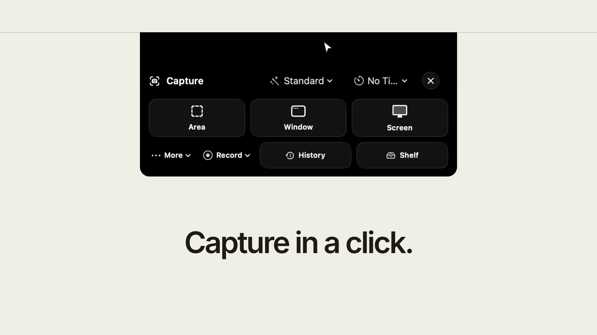

# NotchShot

[](https://github.com/7vibex/NotchShot/actions/workflows/ci.yml)

[](https://github.com/7vibex/NotchShot/releases/download/demo-assets/notchshot-balanced.mp4)

A local-first macOS 26 capture utility that lives in the MacBook notch. Screenshots,
recording, annotation, OCR, history and floating captures — the notch is the capture
launcher, the recording HUD, and the post-capture shelf.

No account, no backend, no telemetry, no subscription. Everything stays on the Mac.

## Build

```bash
./Scripts/build_app.sh --release
open dist/NotchShot.app
```

A real `.app` bundle is required — macOS ties permissions to a bundle identifier and
stable signature. `swift build` / `swift test` work for the library.

## Docs

- [Architecture](Documentation/ARCHITECTURE.md)
- [Live Activities](Documentation/ACTIVITY_ENGINE.md) · [AI activity](Documentation/AI_ACTIVITY.md) · [Notifications](Documentation/NOTIFICATIONS_AND_LOCK_SCREEN.md)
- [Screenshots](Screenshots/README.md)

## Privacy

Captures, recordings, transcripts, OCR text and history stay in
`~/Library/Application Support/NotchShot` or wherever you save them. Bug reports include
nothing unless each choice is explicit.

## License

[MIT](LICENSE)
