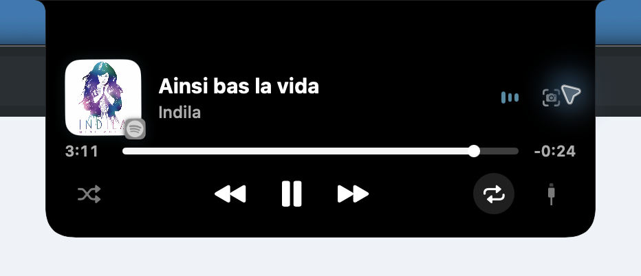
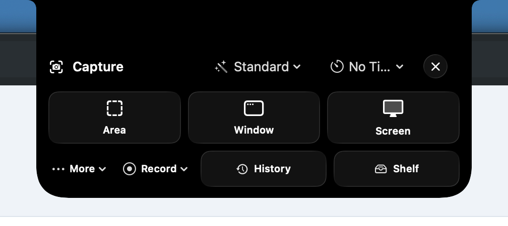
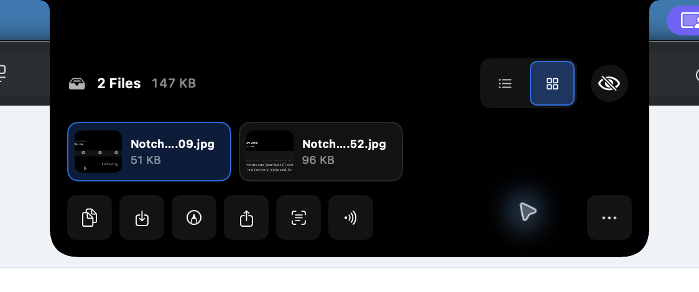
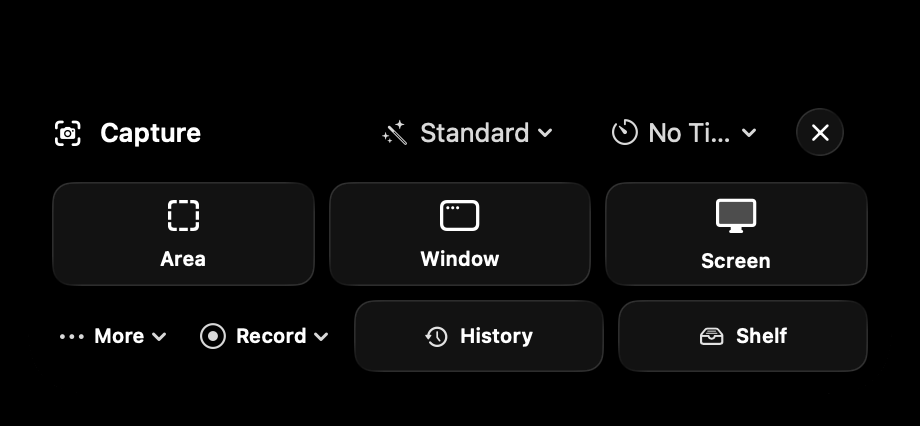
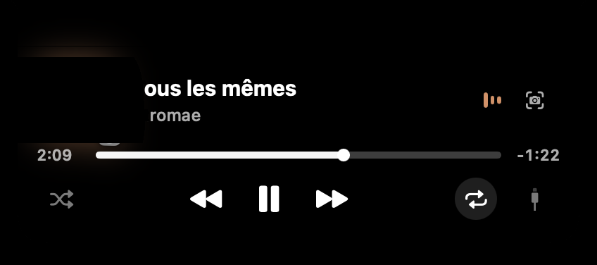

# NotchShot

[](https://github.com/7vibex/NotchShot/actions/workflows/ci.yml)

[](https://github.com/7vibex/NotchShot/releases/download/demo-assets/notchshot-balanced.mp4)

A local-first macOS 26 capture utility that lives in the MacBook notch. Screenshots,
recording, annotation, OCR, history and floating captures, with the notch acting as the
capture launcher, the recording HUD, and the post-capture shelf.

No account, no backend, no telemetry, no subscription. Everything stays on the Mac. The
only network calls are explicit: Spotify artwork over HTTPS (Apple Events fallback only),
Open-Meteo on weather refresh, LocalSend to a user-approved private-network receiver, and
signed update checks in configured builds.

<details>
<summary>See screenshots</summary>

### Now Playing
<p align="center">
  
</p>

### Capture controls
<p align="center">
  
</p>

### Capture shelf
<p align="center">
  
</p>

### Close-up notch states
<p align="center">
  
  
  
</p>

More in [Screenshots](Screenshots/README.md).

</details>

## Features

- **Capture** — area / window / display / previous-area, timers, crosshair, magnifier,
  frozen-screen selection, PNG/JPEG/HEIC, manual and automatic scrolling capture.
- **Recording** — H.264 MP4 with system audio, mic, live waveform, click highlights,
  recording camera, pause/resume, trimming, crash recovery, optional click zoom and
  on-device transcript / `.srt` captions.
- **Annotation** — arrows, shapes, text, pencil, highlighter, numbered steps, blackout,
  pixelate, crop, rotate, undo/redo. Editable `.notchshot` projects. On-device redaction
  is burned into pixels before export; the project keeps the original.
- **Background composer** — presets, padding, radius, shadow, aspect presets, optical
  balancing.
- **OCR** — on-device Vision recognition with paragraphs, lists, table copy as TSV,
  data detectors, QR/barcodes, translation and search indexing.
- **Shelf** — floating pinned captures, drag-and-drop tray (**Shelf / AirDrop / Share /
  ZIP**), rename, move, compress, Quick Look, trash separation, configurable actions.
- **Live Activities** — up to three concurrent activities in the notch (music, recording,
  timers, AI agents, transfers, events), with shared-element transitions, trackpad
  swiping, and a scriptable owner-only socket. See
  [ACTIVITY_ENGINE.md](Documentation/ACTIVITY_ENGINE.md).
- **AI activity** — Claude Code, Codex, Cursor and scripts can report working/waiting/
  finished states, steps and measured progress. See
  [AI_ACTIVITY.md](Documentation/AI_ACTIVITY.md).
- **More** — clipboard history (opt-in), pixel inspector, compare before/after, capture
  stack, export presets, App Shortcuts, notes/lyrics/weather/stats/terminal/launcher,
  window snapping, dictation, voice notes, notification mirroring, LocalSend.
- **Automation** — `notchshot://` URL scheme (capture, record, OCR, pin, open latest) and
  seven App Shortcuts.

## Build and run

```bash
./Scripts/build_app.sh --release
open dist/NotchShot.app
```

Verify capture and recording under the app's real Screen Recording identity:

```bash
dist/NotchShot.app/Contents/MacOS/NotchShot --self-test
```

```bash
swift build          # library + executable
swift test           # full unit and lifecycle suite
```

A real `.app` bundle is required — macOS ties Screen Recording, Microphone and Automation
grants to a bundle identifier plus a stable signature, so a bare binary gets re-prompted
or silently denied every launch. The build refuses to fall back to ad-hoc signing unless
you pass `--adhoc` (which resets your permissions).

## Architecture

```
Sources/NotchShotKit/   Core, Window, Capture, Recording, Annotation, OCR, History,
                        Clipboard, Media, Productivity, UI, Automation, Updates, …
Sources/NotchShotAIReporterSupport/   shared socket wire formats for reporter tools
```

`AppCoordinator` is the single `@MainActor @Observable` facade; services stay dumb and
testable. Activity ordering (`error → selecting → countdown → dictation → recording →
processing → file drop → result → expanded → notification → level → context → media →
idle`) is pinned by `ActivityPriorityTests`. Details in
[ARCHITECTURE.md](Documentation/ARCHITECTURE.md).

## Notch behaviour

- Hover reveals a compact peek; the full interface only opens on click, shortcut, or drag.
- One panel per display; notchless displays get an optional top-centre island.
- Panels never appear in NotchShot's own captures unless you opt in.
- Survives Space switches, fullscreen apps, display hot-plug, resolution change, and wake.

## Automation URLs

```text
notchshot://capture/area?action=copy
notchshot://capture/display?display=2&preset=bug-report&action=annotate
notchshot://record/area
notchshot://ocr?source=clipboard&format=markdown
notchshot://open/latest
notchshot://pin?file=/absolute/path/to/image.png
```

Unknown parameters are rejected, requests are rate-limited, paths are canonicalized and
inode-validated, and every request requires foreground confirmation. The scheme cannot
execute programs or change private settings.

## Permissions

| Permission | When |
|---|---|
| Screen Recording | first screenshot or recording |
| Microphone | first recording with the mic enabled |
| Automation | only if the Apple Events media fallback is used |
| Calendar | only after Calendar Glance is enabled in Settings |

Denials surface in the notch with a deep link to the right System Settings pane.
NotchShot shows **Quit & Reopen** after a Screen Recording grant, because macOS does not
apply it to the running process.

Media integration is pluggable (`MediaSource`): MediaRemote bridge (bring your own
`mediaremote-adapter`), Apple Events (Music/Spotify, off by default), or disabled. The
bridge rides on undocumented system behaviour and fails silently to the next source.

## Privacy

Captures, recordings, transcripts, OCR text, projects and history stay in
`~/Library/Application Support/NotchShot` or wherever you save them. Recognized text
enters the search index only if you enable "Search capture text", and turning it off
deletes what was already stored. Clipboard history is off until enabled, respects
password-manager concealed markers, and is excluded from bug reports. Bug packages never
include logs or account data unless each choice is explicit.

## Distribution

The current bundle is a hardened-runtime, directly distributed Mac app — deliberately not
sandboxed because OSD replacement, shortcut takeover and the external Now Playing helper
conflict with App Sandbox and App Store rules. Release builds require a Developer ID
identity, notarization and Gatekeeper assessment:

```bash
./Scripts/release_app.sh \
  --identity "Developer ID Application: Your Name (TEAMID)" \
  --keychain-profile "notchshot-notary" \
  --version 1.2.0 --build 42
```

Public builds enable Sparkle 2 only when both `NOTCHSHOT_SPARKLE_FEED_URL` (HTTPS) and
`NOTCHSHOT_SPARKLE_PUBLIC_KEY` (EdDSA) are supplied; local builds stay updater-disabled.
The UI is English-only for now.

## Contributing

Read [CONTRIBUTING.md](CONTRIBUTING.md) first. Participation is covered by
[CODE_OF_CONDUCT.md](CODE_OF_CONDUCT.md); report security issues via
[SECURITY.md](SECURITY.md).

CleanShot X is proprietary; this is a clean-room implementation of the same product ideas
on Apple's own frameworks.

## License

[MIT](LICENSE)
